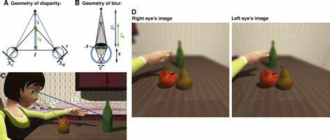

## 双目视觉

双目视觉是立体感知的重要途径。
然而，从双目视觉的原理来看，
也许，我们所认为自己所“看到”的图像或场景，
其实都是脑补出来的。
当然，本文也可以看作是自动景深算法的一个粗糙实现。

---

- [双目视觉](#双目视觉)
- [双目视觉的原理](#双目视觉的原理)
- [双目视觉的模拟](#双目视觉的模拟)

## 双目视觉的原理

顾名思义，双目视觉就是两只眼睛看世界。
由于双眼左、右对置，因此左、右视野其实是不一样的。
简单来说，呈现这样的关系

左、右视野的差异体现在物体的水平坐标上，
而差异的值大小，仅与物体与眼睛之间的距离有关。
这个“距离”，就是物体在场景中的“深度”，
因此，双目视觉是人通过视觉感知距离或深度的重要生理基础。

同时，由于双眼看到的图像不一样，
因此会产生水平方向的模糊。
也就是说，
人眼看到的三维世界，
从来就不是清晰的。

## 双目视觉的模拟

我通过一个简单的实验来模拟这个现象，
首先，找到一张带景深的图

它的景深是非常丰富的，

为了避免计算过于复杂，
我进行了小范围的量化

之后分别取几个目标深度，
我认为图像在这些深度水平上是清晰的，
而之外的深度则产生水平模糊,

简单来说，当你在看天空时，下面建筑是虚的

当你看教堂时，天空是虚的

当你在看树时，后面全是虚的

